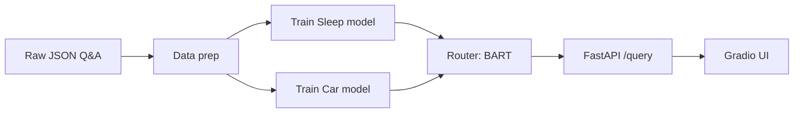

# Multi-Model LLM System with Router

**What it is:** A system that routes user questions to one of two specialized LLMs (sleep science or car history). A zero-shot classifier directs each query to the right model; FastAPI serves inference and Gradio provides the chat UI.

---

## Pipeline



*Flow: Raw data → train two Mistral-7B specialists → BART router classifies query → API + chat UI.*

---

## What the notebooks & code cover

| Artifact | Description |
|----------|-------------|
| `notebooks/data_exploration.ipynb` | Data preprocessing, train/test split, tokenization and EDA (Spacy, CSV export). |
| `notebooks/model_training.ipynb` | Fine-tuning Sleep and Car models with Unsloth (Mistral 7B, LoRA, 4-bit). |
| `notebooks/router.ipynb` | Zero-shot classification with BART-large-mnli for routing queries to sleep vs car. |
| `notebooks/inference_eval.ipynb` | Load fine-tuned models and run inference; ROUGE-style evaluation. |
| `notebooks/matrix_factorization.ipynb` | SVD-based matrix factorization (reference/experiment). |
| `scripts/data_preparation.py` | Batch data prep from raw JSON to processed CSVs; optional HF upload. |
| `scripts/fine_tune_model.py` | Fine-tune Sleep and Car models (Unsloth + TRL). |
| `scripts/query_router.py` | Standalone router: load BART classifier and classify text. |
| `scripts/inference.py` | Inference pipeline for the two specialists. |
| `scripts/evaluate.py` | Evaluation (e.g. ROUGE) for trained models. |
| `main.py` | FastAPI app: router + lazy-loaded Sleep/Car models, `/query` endpoint. |
| `gradio_app.py` | Gradio chat UI calling the FastAPI backend. |

---

## Tech stack (what's inside)

| Layer | Tools / libs |
|-------|----------------|
| **LLM & training** | Mistral 7B, Unsloth, LoRA / 4-bit (BitsAndBytes), TRL (`SFTTrainer`), Hugging Face `transformers`, `datasets` |
| **Router** | `facebook/bart-large-mnli` (zero-shot classification via `transformers` pipeline) |
| **Backend & API** | FastAPI, Uvicorn, Pydantic |
| **Frontend** | Gradio, aiohttp (async client to API) |
| **Data & NLP** | Pandas, SpaCy (`en_core_web_sm`), `rouge_score` |
| **Env & infra** | `python-dotenv`, PyTorch, NumPy, SciPy, Matplotlib, Seaborn |

---

## Dataset / source

- **Raw data:** `data/raw/training_qna_sleep.json`, `data/raw/training_qna_car.json` (Q&A format).
- **Processed:** `data/processed/train_sleep.csv`, `train_car.csv`, `test_sleep.csv`, `test_car.csv` (from data prep).
- **Optional (notebooks):** Hugging Face datasets `thinkersloop/sleep-dataset-llm`, `thinkersloop/car-dataset-llm` for training in notebooks.

---

## How to run

**Conda (recommended)**

```bash
git clone https://github.com/lucky-verma/LLM-Router.git
cd LLM-Router
conda env create -f environment.yml
conda activate webai
```

**Or pip only**

```bash
pip install -r requirements.txt
# Optional: python -m spacy download en_core_web_sm
```

**Prepare data**

```bash
python -m scripts.data_preparation
```

**Backend (API)**

```bash
# Set HF_TOKEN in .env if you use private/gated models
python main.py
```

**Chat UI** (in another terminal, after backend is up)

```bash
python gradio_app.py
```

Open the Gradio URL (e.g. http://localhost:7860) and ask sleep or car questions.

**Optional: fine-tune and evaluate**

```bash
python -m scripts.fine_tune_model
python -m scripts.inference
python -m scripts.evaluate
```

---

## Repo structure

| Path | Purpose |
|------|---------|
| `data/raw/` | Raw Q&A JSON (sleep, car). |
| `data/processed/` | Train/test CSVs and any generated artifacts. |
| `notebooks/` | Data exploration, model training, router, inference eval, matrix factorization. |
| `scripts/` | Data prep, fine-tuning, router, inference, evaluation. |
| `main.py` | FastAPI app (router + Sleep/Car models). |
| `gradio_app.py` | Gradio chat interface. |
| `requirements.txt` | Pip dependencies. |
| `environment.yml` | Conda env (includes CUDA stack where used). |

---

## License

[LICENSE](LICENSE)
